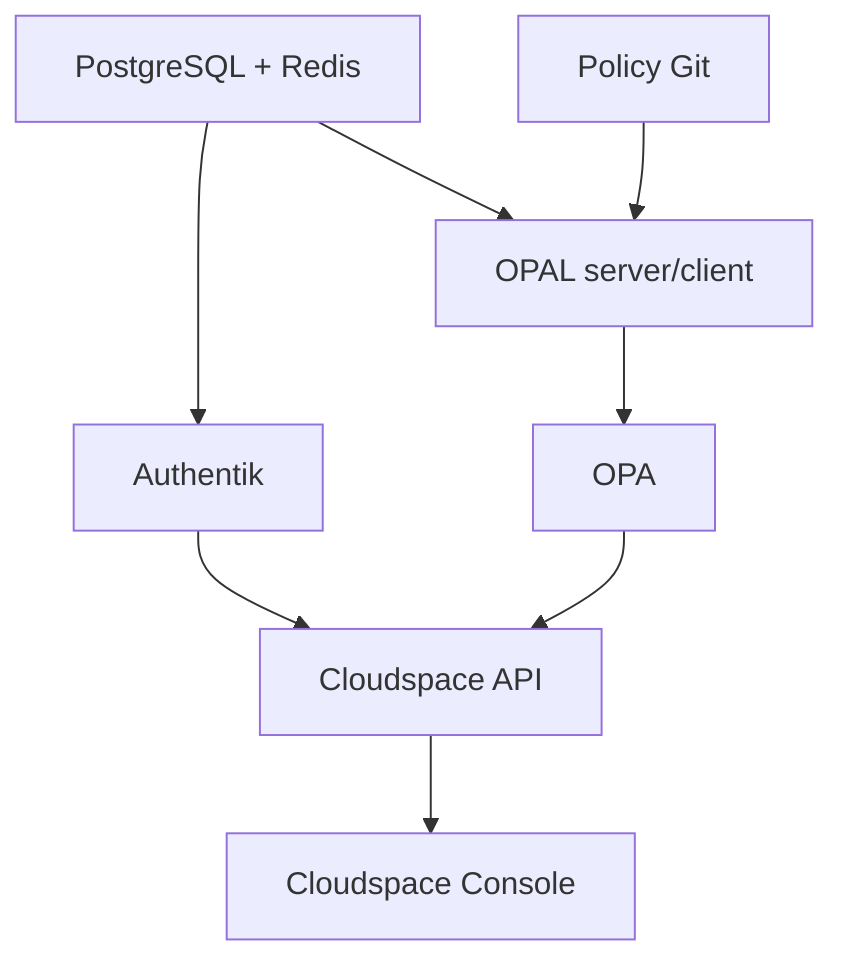

# Argo CD dependency management

## Ownership model

Argo CD owns reconciliation. CI validates charts, builds immutable images, and changes Git desired state. Operators do not use ad-hoc `kubectl apply` or `helm upgrade` for production. `deploy/argocd/dependencies.yaml` manages the dependency releases; `platform-applications.yaml` manages Cloudspace API and console releases.

## Managed dependency graph

The current graph includes pinned external Helm sources for Authentik, OPAL, PostgreSQL, and Redis, plus a Cloudspace-owned OPA chart. Version pins must be reviewed against upstream release notes before promotion.

Upstream references: [Authentik Kubernetes installation](https://docs.goauthentik.io/install-config/install/kubernetes/), [OPA on Kubernetes](https://www.openpolicyagent.org/docs/deploy/k8s), [OPAL Helm chart](https://docs.opal.ac/tutorials/helm-chart-for-kubernetes), [Bitnami PostgreSQL chart](https://github.com/bitnami/charts/tree/main/bitnami/postgresql), and [Bitnami Redis chart](https://github.com/bitnami/charts/tree/main/bitnami/redis).

## Installation procedure

1. Install Argo CD and configure repository credentials.
2. Create the `cloudspace` AppProject with least-privilege source repositories and destinations.
3. Provision the referenced secrets using the cluster secret manager:
   - PostgreSQL credentials;
   - Redis credentials;
   - Authentik secret key and database/cache credentials;
   - OPAL Git/data-source credentials;
   - Cloudspace API OIDC and Stripe credentials.
4. Replace example repository URLs and environment-specific hostnames.
5. Render `dependencies.yaml` and validate it with Kubernetes schemas.
6. Commit the desired-state change.
7. Observe Argo sync, health, migrations, readiness, and policy revision.

## Secret contract

Secrets are referenced by name, never stored in values. Names alone are not sufficient: each chart’s expected key names must be validated against the chart schema during deployment preparation. External secret operators, Sealed Secrets, or a cloud secret manager may implement injection; the application contract remains provider-neutral.

## Upgrades

Upgrade one dependency at a time. Render the exact revision, inspect changed resources, run smoke tests, and promote the same revision through environments. For PostgreSQL, prove backup/restore and migration compatibility. For Authentik, prove OIDC discovery, login, logout, and JWKS rotation. For OPAL/OPA, prove policy revision and stale-data behavior. For Redis, prove queue/cache recovery and persistence assumptions.

## Rollback

Revert the Git desired-state commit or restore a known-good immutable revision. Do not manually delete a database or policy cache to force convergence. If a migration is irreversible, application rollback must be blocked until a forward-compatible repair is prepared.
