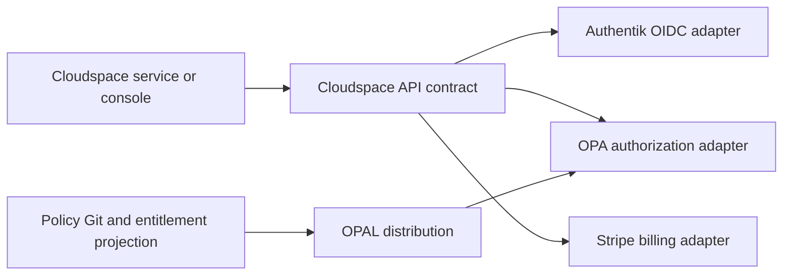

# Cloudspace Shared Platform

  

    
Shared infrastructure for Cloudspace

    <h1>One stable contract. Four replaceable providers.</h1>
    
Authentication, authorization, billing, and entitlement state exposed through Cloudspace-owned APIs—ready for local development and designed for GitOps-managed Kubernetes.

    
<a class="md-button md-button--primary" href="architecture/overview/">Explore the architecture</a><a class="md-button" href="development/local/">Run it locally</a>

  

  

Current vertical slice

<strong>8</strong>API and adapter tests

<strong>3</strong>provider boundaries

<strong>1</strong>canonical OpenAPI contract

## What this platform owns

| Capability | Cloudspace contract | Provider implementation |
|---|---|---|
| Authentication | normalized `Principal` | Authentik OIDC/JWKS |
| Authorization | `authorize(principal, action, resource, context)` | OPA, policy/data distributed by OPAL |
| Billing | accounts, plans, subscriptions, entitlements | Stripe |
| Persistence | Cloudspace-owned projections and audit records | PostgreSQL, Redis for operational workloads |

!!! warning "Know the boundary"
    This is not IAM. Cloudspace Shared Platform does not manage arbitrary cloud roles, access keys, Kubernetes identities, or permissions for every service. It provides shared authentication, policy decisions, and billing facts that services consume.

## The request path

## Start with the right guide

- **Building a consumer?** Read the [contract guide](contracts/guide.md) and [SDK reference](sdk.md).
- **Adding authentication?** Read [Authentik OIDC](authentication/oidc.md).
- **Writing policy?** Read the [authorization model](authorization/model.md).
- **Deploying the platform?** Read [Kubernetes and Argo CD](deployment/kubernetes.md) and [dependency management](deployment/argocd.md).
- **Responding to an incident?** Open the [operations runbook](operations/runbook.md).

!!! info "Implementation status"
    The repository currently provides an offline runnable slice, a tested OIDC/JWKS adapter, an OPA contract adapter, SDK foundations, and GitOps definitions. Live Authentik, OPA/OPAL, Stripe, PostgreSQL, and Kubernetes verification still requires environment-specific credentials and cluster state.
